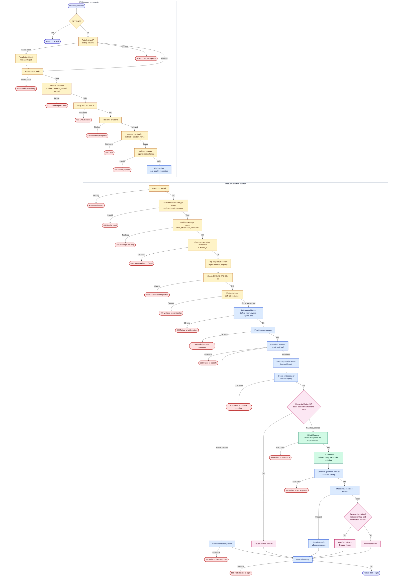

```mermaid
flowchart TD
    subgraph GATEWAY["API Gateway — router.ts"]
        A(["Incoming Request"]) --> B{"OPTIONS?"}
        B -->|Yes| B1(["Return CORS ok"])
        B -->|No| C["Rate limit by IP<br/>sliding window"]
        C -->|Failed open| C0["Fire alert webhook<br/>fire-and-forget"]
        C0 --> D
        C -->|Blocked| C1(["429 Too Many Requests"])
        C -->|Allowed| D["Parse JSON body"]
        D -->|Invalid JSON| D1(["400 Invalid JSON body"])
        D -->|Valid| E["Validate envelope<br/>method / function_name / payload"]
        E -->|Invalid| E1(["400 Invalid request body"])
        E -->|Valid| F["Verify JWT via JWKS"]
        F -->|No userId| F1(["401 Unauthorized"])
        F -->|OK| G["Rate limit by userId"]
        G -->|Blocked| G1(["429 Too Many Requests"])
        G -->|Allowed| H["Look up handler by<br/>method + function_name"]
        H -->|Not found| H1(["400 / 404"])
        H -->|Found| I["Validate payload<br/>against zod schema"]
        I -->|Invalid| I1(["400 Invalid payload"])
        I -->|Valid| J["Call handler<br/>e.g. chatConversation"]
    end
 
    J --> K
 
    subgraph HANDLER["chatConversation handler"]
        K["Check ctx.userId"] -->|Missing| K1(["401 Unauthorized"])
        K -->|OK| L["Validate conversation_id UUID<br/>and non-empty message"]
        L -->|Invalid| L1(["400 Invalid input"])
        L -->|Valid| M["Sanitize message,<br/>check MAX_MESSAGE_LENGTH"]
        M -->|Too long| M1(["400 Message too long"])
        M -->|OK| N["Check conversation ownership<br/>id + user_id"]
        N -->|Not found| N1(["404 Conversation not found"])
        N -->|OK| O["Flag suspicious content<br/>regex heuristic, log only"]
        O --> P["Check OPENAI_API_KEY set"]
        P -->|Missing| P1(["500 Server misconfiguration"])
        P -->|OK| Q["Moderate input<br/>soft-fail on outage"]
        Q -->|Flagged| Q1(["400 Violates content policy"])
        Q -->|OK or unchecked| R["Fetch prior history<br/>before insert, avoids replica race"]
        R -->|DB error| R1(["500 Failed to fetch history"])
        R -->|OK| S["Persist user message"]
        S -->|DB error| S1(["500 Failed to store message"])
        S -->|OK| T["Classify + Rewrite<br/>single LLM call"]
        T -->|LLM error| T1(["502 Failed to classify"])
 
        T -->|Not ML-related| U["General chat completion"]
        U -->|LLM error| U1(["502 Failed to get response"])
        U --> AA
 
        T -->|ML-related| V["Log query rewrite async<br/>fire-and-forget"]
        V --> W["Create embedding of<br/>rewritten query"]
        W -->|LLM error| W1(["502 Failed to process question"])
        W -->|OK| X{"Semantic Cache Hit?<br/>score above threshold and fresh"}
        X -->|Yes| X1["Reuse cached answer"]
        X1 --> AA
        X -->|No, stale, or miss| Y["Hybrid Search<br/>vector + keyword via Supabase RPC"]
        Y -->|RPC error| Y1(["500 Failed to search KB"])
        Y -->|OK| Z["LLM Reranker<br/>fallback: keep RRF order on failure"]
        Z --> AB["Generate grounded answer<br/>context + history"]
        AB -->|LLM error| AB1(["502 Failed to get response"])
        AB -->|OK| AC["Moderate generated answer"]
        AC -->|Flagged| AC1["Substitute safe<br/>fallback message"]
        AC -->|Clean| AD{"Cache-write eligible?<br/>no injection flag and<br/>moderation passed"}
        AC1 --> AA
        AD -->|Yes| AD1["storeCacheAsync<br/>fire-and-forget"]
        AD -->|No| AD2["Skip cache write"]
        AD1 --> AA
        AD2 --> AA
 
        AA["Persist bot reply"] -->|DB error| AA1(["500 Failed to store reply"])
        AA -->|OK| AE(["Return 200 + reply"])
    end
 
    classDef entry fill:#e0e7ff,stroke:#4338ca,stroke-width:1.5px,color:#1e1b4b
    classDef security fill:#fef3c7,stroke:#b45309,stroke-width:1.5px,color:#451a03
    classDef cache fill:#fce7f3,stroke:#be185d,stroke-width:1.5px,color:#500724
    classDef retrieval fill:#d1fae5,stroke:#047857,stroke-width:1.5px,color:#022c22
    classDef generation fill:#dbeafe,stroke:#1d4ed8,stroke-width:1.5px,color:#172554
    classDef errorpath fill:#fee2e2,stroke:#b91c1c,stroke-width:1.5px,color:#450a0a
 
    class A,AE,B1 entry
    class B,C,C0,D,E,F,G,H,I,K,L,M,N,O,P,Q security
    class C1,D1,E1,F1,G1,H1,I1,K1,L1,M1,N1,P1,Q1,R1,S1,T1,U1,W1,Y1,AB1,AA1 errorpath
    class X,X1,AD,AD1,AD2 cache
    class Y,Z retrieval
    class J,R,S,T,U,V,W,AB,AC,AC1,AA generation
 
    style GATEWAY fill:#ffffff,stroke:#94a3b8,stroke-width:1px,color:#0f172a
    style HANDLER fill:#ffffff,stroke:#94a3b8,stroke-width:1px,color:#0f172a
```
