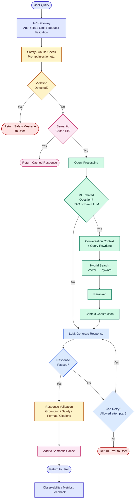

```mermaid
flowchart TD
    A(["User Query"]) --> B["API Gateway<br/>Auth / Rate Limit / Request Validation"]
    B --> C["Safety / Abuse Check<br/>Prompt injection etc."]
    C --> C1{"Violation<br/>Detected?"}
    C1 -->|Yes| C2(["Return Safety Message<br/>to User"])
    C1 -->|No| D{"Semantic<br/>Cache Hit?"}
    D -->|Yes| E(["Return Cached Response"])
    D -->|No| F["Query Processing"]
    F --> G{"ML Related<br/>Question?<br/>RAG or Direct LLM"}
    G -->|No| L["LLM: Generate Response"]
    G -->|Yes| H["Conversation Context<br/>+ Query Rewriting"]
    H --> I["Hybrid Search<br/>Vector + Keyword"]
    I --> J["Reranker"]
    J --> K["Context Construction"]
    K --> L
    L --> P{"Response<br/>Passed?"}
    P -->|Yes| M["Response Validation<br/>Grounding / Safety / Format / Citations"]
    P -->|No| Q{"Can Retry?<br/>Allowed attempts: 5"}
    Q -->|Yes| L
    Q -->|No| R(["Return Error to User"])
    M --> S["Add to Semantic Cache"]
    S --> N(["Return to User"])
    N --> O["Observability / Metrics / Feedback"]
    classDef entry fill:#e0e7ff,stroke:#4338ca,stroke-width:1.5px,color:#1e1b4b
    classDef security fill:#fef3c7,stroke:#b45309,stroke-width:1.5px,color:#451a03
    classDef cache fill:#fce7f3,stroke:#be185d,stroke-width:1.5px,color:#500724
    classDef retrieval fill:#d1fae5,stroke:#047857,stroke-width:1.5px,color:#022c22
    classDef generation fill:#dbeafe,stroke:#1d4ed8,stroke-width:1.5px,color:#172554
    classDef errorpath fill:#fee2e2,stroke:#b91c1c,stroke-width:1.5px,color:#450a0a
    class A,B,N,O entry
    class C,C1,M security
    class C2,R errorpath
    class D,E,S cache
    class F,G,H,I,J,K retrieval
    class L,P,Q generation
```
